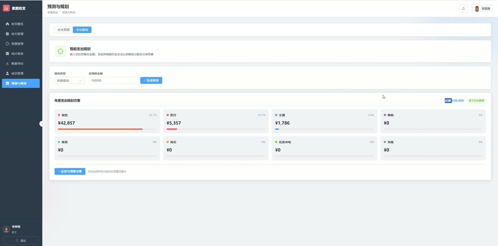
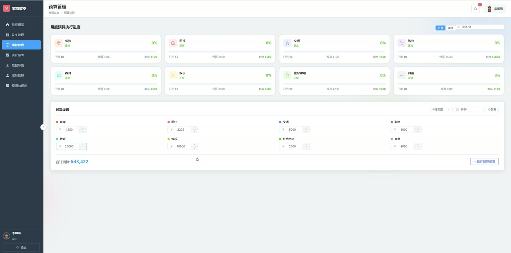
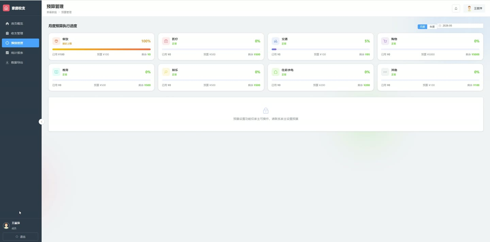
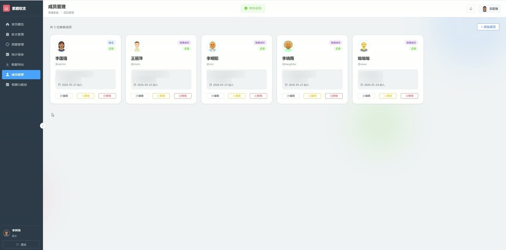
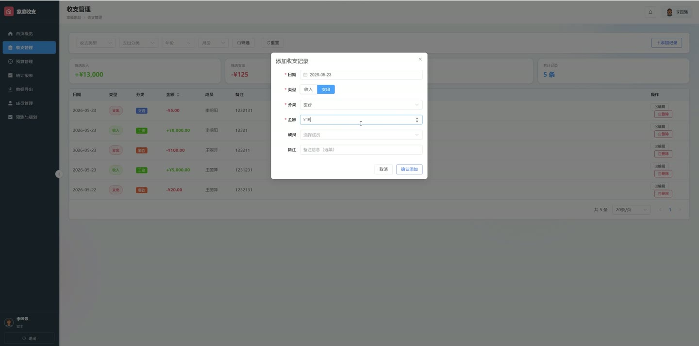

# (附文档)Python+Flask+Vue3 家庭收支管理与规划系统

**技术栈**：Python、Flask、Vue3、MySQL

### 系统简介

本系统是一套基于 Python Flask 与 Vue3 的家庭收支管理与规划平台，采用前后端分离架构，通过 JWT 完成身份认证与接口鉴权。系统包含普通用户端与管理员端两类角色，覆盖收支记账、预算设置与执行进度、财务统计分析、收支趋势预测与支出规划、成员管理等完整业务闭环，前端使用 Element Plus 与 ECharts 呈现可视化报表。
 
### 核心功能
 
### 普通用户端

 
- 登录系统：输入用户名与密码完成登录，支持回车提交与快速登录体验入口，登录成功后跳转首页概览。 
- 首页概览卡片：查看本月收入、本月支出、本月结余、未读通知数量，并展示较上月的收入与支出环比变化及储蓄率。 
- 超支预警提示：当某分类实际支出超出预算时，首页顶部展示该分类的实际金额、预算金额、超支金额与超支百分比。 
- 近6个月收支趋势图：以折线图展示近6个月收入与支出走势，支持悬浮查看每月具体数值。 
- 支出分类占比图：以环形饼图展示各支出分类的金额与占比，支持图例滚动与悬浮高亮。 
- 本月预算执行进度：按分类展示已用金额、预算金额、剩余金额与使用百分比，超支与接近上限的分类以不同颜色标识。 
- 最近收支记录：展示最近8条收支记录的分类、成员姓名、日期与金额，并可按收入/支出区分正负号。 
- 收支记录管理：查看收支记录列表，支持分页浏览、按条件筛选，并查看每条记录的分类、金额、成员与日期信息。 
- 预算执行进度查询：切换月度或年度维度，选择具体月份或年份查看各分类预算执行进度。 
- 预算设置（仅家主）：选择月度或年度期间，为餐饮、医疗、交通、购物、教育、娱乐、住房水电、其他等分类逐项填写预算金额并保存。 
- 财务统计分析：查看月度收支趋势、支出分类占比、成员支出对比、医疗支出专项等图表，支持按月份筛选刷新。 
- 数据导出：进入导出页面进行收支数据的导出操作。
 
### 管理员端

 
- 管理后台总览：查看家庭成员数（活跃/总数）、总收入、总支出、累计结余、记录总条数、未读消息等统计卡片。 
- 快速操作入口：通过卡片快捷跳转至成员管理、预算设置、财务分析、收支记录等常用功能页面。 
- 家庭成员概况：以卡片形式展示每位成员的姓名、角色（家主/成员）、账号状态（正常/已禁用）与头像。 
- 成员列表管理：查看全部家庭成员，展示用户名、姓名、邮箱、手机、加入日期、角色与状态。 
- 添加成员：填写用户名、密码、姓名、角色、邮箱、手机等信息新增家庭成员。 
- 编辑成员：修改成员姓名、邮箱、手机，并可选择重置登录密码。 
- 禁用/启用成员：对非家主成员执行账号禁用或启用操作，操作前弹出二次确认。 
- 移除成员：将非家主成员从家庭中移除，操作不可撤销并需二次确认。 
- 预算设置：按月度或年度维度，为各支出分类逐项设置预算金额并保存，实时汇总总预算与月均折算。 
- 预算汇总分析：展示已设置分类数量、期间总预算、折算金额，并以进度条展示各分类预算占比。 
- 收支趋势预测：基于最近若干月历史数据，使用移动平均法预测未来3个月的收入、支出与结余，并给出各分类支出明细。 
- 预测图表展示：以实线展示历史收支、虚线展示预测收支，支持重新预测与切换标签页重绘。 
- 智能支出规划：输入总预算金额并选择月度或年度，系统按历史支出比例自动分配各分类预算并给出占比。 
- 规划结果应用：一键将规划分配结果保存为当前月或当前年的预算设置。
 
### 技术栈

 后端框架Python + Flask 认证鉴权Flask-JWT-Extended（JWT Token 认证） 跨域处理Flask-CORS 前端框架Vue3（Composition API + 单文件组件） 前端路由Vue Router（含登录校验与管理员权限守卫） 状态管理Pinia（auth store） UI 组件库Element Plus 图表可视化ECharts + vue-echarts 构建工具Vite 数据库MySQL
 
### 交付内容

 
- 后端完整源码 
- 前端完整源码 
- 数据库初始化脚本 
- 万字文档

## 界面展示

---

## 获取完整源码 + 万字文档

本仓库为项目介绍页。**完整前后端源码、数据库初始化脚本、万字项目文档**，请加微信 `kangkangcode`，或访问 [codekk.top](http://codekk.top) 获取。

可作课程设计 / 毕业设计参考，支持远程部署调试。